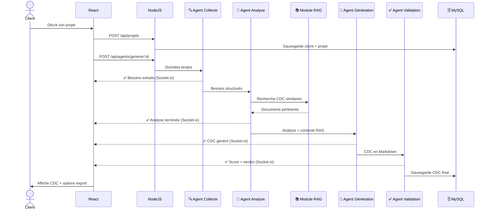

<div align="center">

<!-- Animated Logo -->


<br/>

<!-- Badges principaux -->


<br/>


<br/><br/>

> **Conception d'un système multi-agents pour l'automatisation de l'analyse des besoins clients et la génération de cahiers des charges préliminaires**
>
> *Cas d'EPS SARL — Projet de stage Ingénieur 2026*

</div>

---

## 📌 Table des matières

- [🎯 Présentation](#-présentation)
- [🧠 Architecture Multi-Agents](#-architecture-multi-agents)
- [🔄 Comment ça marche](#-comment-ça-marche)
- [🛠️ Stack technique](#️-stack-technique)
- [📦 Installation](#-installation)
- [🚀 Lancement](#-lancement)
- [📁 Structure du projet](#-structure-du-projet)
- [📡 API Endpoints](#-api-endpoints)
- [🤖 Les 4 Agents IA](#-les-4-agents-ia)
- [📚 Module RAG](#-module-rag)
- [👤 Auteur](#-auteur)

---

## 🎯 Présentation

<div align="center">

</div>

<br/>

**CDCEPS** est un système intelligent développé pour **EPS SARL** qui automatise la création de cahiers des charges préliminaires. Grâce à une architecture multi-agents et un module RAG (Retrieval Augmented Generation), le système transforme une description brute de projet en un document professionnel structuré en quelques minutes.

### 🔥 Valeur ajoutée

| Avant CDCEPS | Après CDCEPS |
|---|---|
| ⏱️ 2 à 5 heures de rédaction manuelle | ⚡ 2 à 5 minutes de génération automatique |
| 📉 Qualité variable selon le rédacteur | 📈 Qualité standardisée et mesurée (score /100) |
| 🔄 Multiples allers-retours client | ✅ CDC structuré dès la première génération |
| 💸 Coût humain élevé | 💰 Ressources libérées pour des tâches à valeur |

---

## 🧠 Architecture Multi-Agents

```
┌─────────────────────────────────────────────────────────────┐
│                     Frontend React                          │
│          Formulaire · Chat · Visualisation CDC              │
└──────────────────────┬──────────────────────────────────────┘
                       │ REST + WebSocket (Socket.io)
┌──────────────────────▼──────────────────────────────────────┐
│                  API Gateway Node.js                        │
│           Auth · Routing · Validation · Temps réel         │
└──────────────────────┬──────────────────────────────────────┘
                       │ HTTP interne
┌──────────────────────▼──────────────────────────────────────┐
│               Orchestrateur PHP                             │
│      Gestion sessions · Assemblage CDC · Export PDF        │
└──────┬───────────┬──────────────┬───────────────┬───────────┘
       │           │              │               │
  ┌────▼───┐  ┌───▼────┐  ┌─────▼────┐  ┌──────▼─────┐
  │Agent 1 │→ │Agent 2 │→ │ Agent 3  │→ │  Agent 4   │
  │Collecte│  │Analyse │  │Génération│  │ Validation │
  └────────┘  └────────┘  └──────────┘  └────────────┘
                               ↑
                    ┌──────────┴──────────┐
                    │    Module RAG       │
                    │  Base documentaire  │
                    │  Embeddings OpenAI  │
                    └─────────────────────┘
```

---

## 🔄 Comment ça marche



---

## 🛠️ Stack technique

<div align="center">

| Couche | Technologie | Rôle |
|--------|------------|------|
| 🎨 Frontend | React + Vite | Interface utilisateur |
| ⚡ Temps réel | Socket.io | Progression des agents |
| 🔌 API Gateway | Node.js + Express | Routage + validation |
| 🧠 Agents IA | Node.js + OpenAI SDK | Pipeline multi-agents |
| 📚 RAG | Embeddings OpenAI | Recherche sémantique |
| ⚙️ Métier | PHP | Gestion CDC + export |
| 🗄️ Base de données | MySQL | Persistance |
| 📄 Export PDF | Puppeteer | Génération PDF |
| 🤖 LLM | GPT-4o-mini | Traitement langage naturel |

</div>

---

## 📦 Installation

### Prérequis

```bash
node >= 18.0.0
php >= 8.0
mysql >= 8.0
pnpm >= 8.0
```

### 1. Cloner le projet

```bash
git clone https://github.com/votre-username/cdceps.git
cd cdceps
```

### 2. Base de données

```bash
sudo mysql < database.sql
```

### 3. Backend Node.js

```bash
cd backend
pnpm install
cp .env.example .env
# Éditez .env avec vos configurations
```

### 4. Frontend React

```bash
cd frontend
pnpm install
```

### 5. Variables d'environnement

```env
# backend/.env
PORT=3001
DB_HOST=localhost
DB_USER=cdceps_user
DB_PASSWORD=votre_mot_de_passe
DB_NAME=cdceps
OPENAI_API_KEY=sk-xxxxxxxxxxxxxxxxxxxx
SESSION_SECRET=votre_secret_key
```

---

## 🚀 Lancement

```bash
# Terminal 1 — Backend Node.js
cd backend && pnpm dev

# Terminal 2 — Frontend React
cd frontend && pnpm dev
```

| Service | URL |
|---------|-----|
| 🌐 Frontend React | http://localhost:5173 |
| ⚡ API Node.js | http://localhost:3001 |
| 🔍 Health check | http://localhost:3001/api/health |
| 🖥️ PHP Admin | http://localhost/cdceps/php-admin |

---

## 📁 Structure du projet

```
cdceps/
│
├── 📄 database.sql              # Schéma complet de la base
│
├── 🟢 backend/                  # API Node.js
│   ├── agents/
│   │   ├── baseAgent.js         # Classe parente des agents
│   │   ├── agentCollecte.js     # Agent 1 — Extraction besoins
│   │   ├── agentAnalyse.js      # Agent 2 — Analyse + RAG
│   │   ├── agentGeneration.js   # Agent 3 — Génération CDC
│   │   └── agentValidation.js   # Agent 4 — Validation qualité
│   ├── services/
│   │   ├── orchestrateur.js     # Chef d'orchestre du pipeline
│   │   ├── openaiService.js     # Client OpenAI centralisé
│   │   └── ragService.js        # Module RAG + similarité cosinus
│   ├── routes/
│   │   ├── projets.js           # CRUD projets + clients
│   │   ├── agents.js            # Déclenchement pipeline
│   │   └── documents.js         # CDC + export PDF/Markdown
│   ├── database/
│   │   └── mysql.js             # Pool de connexions MySQL
│   └── server.js                # Point d'entrée Express
│
├── ⚛️  frontend/                 # Interface React
│   └── src/
│       ├── pages/
│       │   ├── LandingPage.jsx      # Page d'accueil
│       │   ├── FormulairePage.jsx   # Saisie projet (2 étapes)
│       │   ├── GenerationPage.jsx   # Progression temps réel
│       │   └── ResultatPage.jsx     # CDC + export
│       ├── components/
│       │   ├── Navbar.jsx           # Navigation
│       │   ├── AgentProgressBar.jsx # Visualisation pipeline
│       │   └── CDCViewer.jsx        # Rendu Markdown
│       └── services/
│           ├── api.js               # Appels REST centralisés
│           └── socket.js            # Client Socket.io
│
└── 🐘 php-admin/                # Interface admin PHP
    ├── config/
    ├── controllers/
    ├── models/
    ├── views/
    └── exports/
```

---

## 📡 API Endpoints

```
GET    /api/health                        # Santé du serveur
POST   /api/projets                       # Créer un projet
GET    /api/projets                       # Lister les projets
GET    /api/projets/:id                   # Détail projet
POST   /api/agents/generer/:projetId      # Lancer le pipeline
GET    /api/agents/session/:uuid          # Statut session
GET    /api/agents/sessions/:projetId     # Historique sessions
GET    /api/documents/cdc                 # Lister les CDC
GET    /api/documents/cdc/:id             # Détail CDC
GET    /api/documents/cdc/:id/pdf         # Export PDF
GET    /api/documents/cdc/:id/markdown    # Export Markdown
POST   /api/documents/rag                 # Indexer document RAG
GET    /api/documents/rag                 # Lister documents RAG
```

---

## 🤖 Les 4 Agents IA

<div align="center">

```
  🔍 Agent 1          🔎 Agent 2          📝 Agent 3          ✅ Agent 4
  ──────────          ──────────          ──────────          ──────────
  Collecte            Analyse             Génération          Validation
                                                              
  Extrait les    →    Classifie      →    Génère le      →    Score
  besoins            par priorité        CDC complet         qualité
  structurés         Détecte les         en Markdown         /100
  depuis le          risques             Enrichi par         Sections
  texte libre        Interroge           le RAG              manquantes
                     le RAG                                  Verdict
```

</div>

### Prompt engineering

Chaque agent dispose d'un **prompt système** spécialisé qui définit :
- Son rôle et son expertise simulée
- Le format de sortie attendu (JSON structuré)
- Le niveau de créativité (température OpenAI)
- Les contraintes métier d'EPS SARL

---

## 📚 Module RAG

Le module **RAG (Retrieval Augmented Generation)** enrichit la génération en cherchant dans les anciens CDC d'EPS SARL les documents les plus similaires au projet en cours.

```
Description projet
      │
      ▼
┌─────────────────┐
│ Embedding OpenAI │  → Vecteur [0.023, -0.156, 0.891, ...]
│ text-embedding   │    (1536 dimensions)
│ -3-small         │
└────────┬────────┘
         │
         ▼
┌─────────────────────────────┐
│  Similarité Cosinus         │
│  Comparaison avec tous les  │
│  documents de la base RAG   │
└────────┬────────────────────┘
         │
         ▼
┌─────────────────────────────┐
│  Top 3 documents similaires │
│  (score > 0.5)              │
└────────┬────────────────────┘
         │
         ▼
  Injection dans le prompt
  de l'Agent Génération
```

---

## 👤 Auteur

<div align="center">

**DIAWANE Ramatoulaye**
*Étudiant Ingénieur en Informatique*

[](https://linkedin.com/in/votre-profil)
[](https://github.com/Ramadiaw12)

*Projet de stage réalisé chez **EPS SARL** — 2026*

---

⭐ N'hésitez pas à star le projet &nbsp;|&nbsp; Contributions bienvenues !

</div>